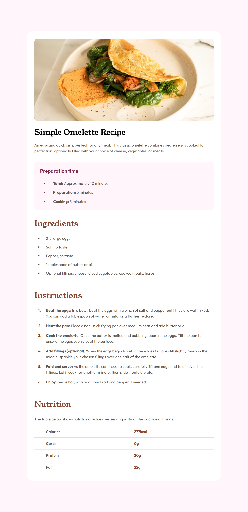

# Frontend Mentor - Recipe page solution

This is a solution to the [Recipe page challenge on Frontend Mentor](https://www.frontendmentor.io/challenges/recipe-page-KiTsR8QQKm). Frontend Mentor challenges help you improve your coding skills by building realistic projects.

## Table of contents

- [Overview](#overview)
  - [Screenshot](#screenshot)
  - [Links](#links)
- [My process](#my-process)
  - [Built with](#built-with)
  - [What I learned](#what-i-learned)
- [Author](#author)
- [Acknowledgments](#acknowledgments)

## Overview

### Screenshot



### Links

- [Solution URL](https://github.com/ralphvirtucio/recipe-page)
- [Live Site URL](https://ralphvirtucio.github.io/recipe-page/)

## My process

### Built with

- Semantic HTML5 markup
- CSS custom properties
- Flexbox
- Mobile-first workflow

### What I learned

While doing this challenge I learned how to use counter, counter-reset, counter-increment css properties. This solution shows how to create or style more customizable ordered list number and unordered list dot.

I also learn that it is a great approach to research first for a same website/project that you're doing. This gives you an idea on how to structure HTML, style the elements and how a interaction works.

```css
.recipe-steps__list {
  counter-reset: section;
  display: flex;
  flex-direction: column;
  gap: 1rem;
  margin-block: 1.5rem;
  padding-inline-start: 2rem;
}

.recipe-steps__list-item {
  font-family: var(--ff-body);
  color: var(--neutral-color-5);
}
.recipe-steps__list-item p {
  margin-inline-start: 1rem;
}

.recipe-steps__list-item em {
  font-style: normal;
  font-weight: var(--fw-700);
}

.recipe-steps__list-item::before {
  content: counter(section) ".";
  counter-increment: section;
  position: absolute;
  margin-inline-start: -1rem;
  font-weight: 700;
  font-family: var(--ff-body);
  color: var(--primary-color-1);
}
```

## Author

- Website - [Ralph Virtucio](https://ralphvirtucio-portfolio.vercel.app/)
- Frontend Mentor - [@ralphvirtucio](https://www.frontendmentor.io/profile/ralphvirtucio)

## Acknowledgments

I would like to acknowledge the developers who created this [website](https://www.allrecipes.com/recipe/213700/enchiladas-verdes/). This gives me a lot of idea on how I will structure my HTML and style my css.
